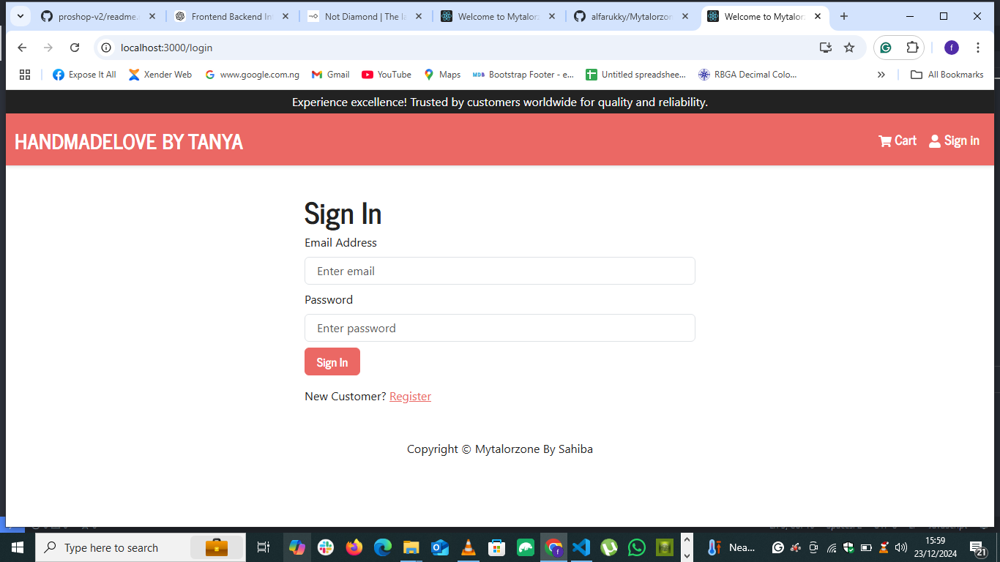

# Overview

Mytailorzone_By_Sahiba is a full-stack e-commerce application that enables customers to explore, customize, and purchase high-quality tailoring and fashion products online. The project is built with React on the frontend and integrates with a pre-provided backend for seamless data management and functionality.
This application provides a user-friendly online shopping experience, complete with a dynamic product catalog, cart management, and a checkout process. It leverages modern UI frameworks and state management tools to ensure optimal performance and responsiveness.

## Features

- **Dynamic Product Catalog**: Browse through a variety of products fetched dynamically from the backend.
**- Shopping Cart:**Add products to the cart, update quantities, and view the total price dynamically.
** Price Formatting:**  Supports currency formatting for a localized shopping experience.
** Checkout Process: ** Seamless navigation from cart to checkout.
** Responsive Design:**  Ensures a mobile-friendly and visually appealing interface.
** Toast Notifications:**  Feedback for user actions such as adding items to the cart or completing a purchase.

### Screenshot

# Links

- Solution URL: []

# Built with

- eact: A JavaScript library for building user interfaces.
-Redux Toolkit: For state management.
-React Router DOM: For routing and navigation.
-Bootstrap & React-Bootstrap: For responsive UI components and layout.
-React Toastify: For user notifications.
-Backend API: A pre-provided backend for data management.
